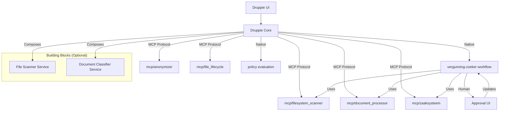

# Druppie Core Upgrade Roadmap
## Enabling Full-Stack Application Building for Complex Functional Designs

**Date**: 2025-01-14
**Status**: Updated with Hybrid Architecture

## 🎯 Architectural Approach: Hybrid Strategy

### Recommended Approach: MCPs + Native Workflows + Building Blocks

**Why Hybrid?**
- **MCPs**: Best for external systems, cross-language tools, file operations
- **Native Workflows**: Best for business logic, state machines, policy enforcement
- **Building Blocks**: Best for infrastructure deployment, reusable patterns
- **UI Integration**: Druppie UI should orchestrate, not implement

**Architecture Overview:**


**Layer Responsibilities:**
| Layer | Components | Approach |
|--------|-----------|-----------|
| **Tool Layer** | File scanning, OCR, DB access | **MCPs** (flexible, language-agnostic) |
| **Infrastructure Layer** | Kubernetes deployment, scaling | **Building Blocks** (declarative, reusable) |
| **Business Logic Layer** | State machines, policy enforcement | **Native Workflows** (deterministic, Go-based) |
| **UI Layer** | Orchestration, status display | **MCPs + Building Blocks** (expose capabilities) |


---

## 📋 Executive Summary

The current Druppie Core architecture is well-designed for orchestrating AI agents and managing simple workflows. However, to support complex functional designs like the "Vergunning zoeker" (Permit Finder), the core requires significant enhancements in several key areas:

1. **File System Scanning & Batch Processing**
2. **Document Processing & Classification**
3. **Privacy & Anonymization**
4. **Quarantine & File Lifecycle Management**
5. **Policy Engine Implementation**
6. **Database Integration & State Management**
7. **Workflow Engine for Complex Business Processes**
8. **Parallel Batch Execution Capabilities**

This roadmap provides a structured approach to implementing these capabilities.

---

## 🎯 Target Use Case: Vergunning zoeker

The "Vergunning zoeker" functional design requires:

| Component | Current State | Required State | Gap |
|-----------|--------------|----------------|------|
| **File Scanner** | Basic file read/write | Batch scanning with pattern matching | ❌ Large |
| **Document Processor** | None | OCR, PDF parsing, classification | ❌ Critical |
| **Privacy Filter** | None | BSN detection, PII redaction | ❌ Critical |
| **Policy Engine** | Designed but not implemented | Trust score evaluation, human-in-loop routing | ❌ Medium |
| **Quarantine System** | None | Processed → Quarantine → Delete (30-day retention) | ❌ Medium |
| **Database MCP** | None | Direct Zaaksysteem API integration | ❌ Medium |
| **Batch Processing** | Sequential step execution | Parallel file processing | ❌ Large |
| **State Machine** | Plan-based DAG | Complex business process state management | ❌ Medium |

---

## 🔍 Current Architecture Analysis

### Existing Strengths

1. **Modular Agent System**: Well-defined agent types (spec_agent, exec_agent, native workflows)
2. **MCP Protocol**: Standardized tool interface for extensibility
3. **Registry Pattern**: Centralized capability discovery (agents, skills, blocks, MCP servers)
4. **Task Manager**: Robust step execution with dependency resolution
5. **IAM Integration**: Role-based access control for registry filtering
6. **Native Workflows**: Go-based deterministic workflows for complex logic

### Identified Limitations

1. **No Batch File Processing**: Can only process files one at a time through individual steps
2. **No Document Intelligence**: No built-in OCR, PDF parsing, or document classification
3. **No Privacy Layer**: No PII detection, BSN filtering, or content redaction
4. **No File Lifecycle Management**: No concept of file states (new → processing → quarantined → deleted)
5. **Policy Engine Not Implemented**: Design exists but no actual policy evaluation logic
6. **No Database MCP**: No direct database integration for Zaaksysteem
7. **Limited State Management**: Plan-based DAG is insufficient for complex business processes
8. **No Parallel Batch Execution**: Steps run sequentially, not in parallel batches

---

## 🛣️ Detailed Upgrade Recommendations

### Phase 1: File System & Batch Processing (Priority: CRITICAL)

#### 1.1 Enhanced File System MCP Server

**Location**: `mcp/filesystem_scanner.md`

**Required Capabilities**:
- Batch directory scanning with pattern matching (`*vergunning*`, `*beschikking*`, `*.pdf`)
- Recursive directory traversal with ACL awareness
- File metadata extraction (size, type, modification date)
- Progress reporting for long-running scans

**Implementation**:
```yaml
---
id: filesystem-scanner
name: "File System Scanner MCP"
type: mcp
category: utility
command: node
args:
  - ./.druppie/plugins/filesystem-scanner/index.js
transport: stdio
tools:
  - name: scan_directory
    description: "Recursively scan a directory for files matching patterns"
    inputSchema:
      type: object
      properties:
        path:
          type: string
          description: "Directory path to scan"
        patterns:
          type: array
          items:
            type: string
          description: "File patterns to match (glob syntax)"
        max_depth:
          type: integer
          description: "Maximum directory depth to scan"
  - name: get_file_metadata
    description: "Get metadata for a specific file"
    inputSchema:
      type: object
      properties:
        path:
          type: string
          description: "File path"
  - name: batch_scan_progress
    description: "Get progress of an ongoing batch scan"
    inputSchema:
      type: object
      properties:
        scan_id:
          type: string
          description: "Scan job identifier"
```

**Core Changes Required**:
```go
// core/internal/mcp/manager.go - Add batch scan tracking
type BatchScanJob struct {
    ID        string
    Status    string // "running", "completed", "paused"
    Total     int
    Processed int
    Results   []FileMetadata
}

type FileMetadata struct {
    Path         string
    Size         int64
    Type         string
    Modified     time.Time
    ACL          []string
    MatchedPattern string
}
```

#### 1.2 Batch Processing Executor

**Location**: `core/internal/executor/batch_processor.go`

**Purpose**: Execute multiple file operations in parallel batches

**Interface**:
```go
type BatchProcessor interface {
    ExecuteBatch(ctx context.Context, items []interface{}) ([]BatchResult, error)
    GetProgress(ctx context.Context, batchID string) (BatchProgress, error)
}

type BatchResult struct {
    Item       interface{}
    Success    bool
    Error      error
    Output     map[string]interface{}
}

type BatchProgress struct {
    BatchID    string
    Total       int
    Completed   int
    Failed      int
}
```

**Integration with Task Manager**:
```go
// core/druppie/task_manager.go - Add batch execution
func (tm *TaskManager) ExecuteBatchStep(step *model.Step, processor BatchProcessor) error {
    batchID := fmt.Sprintf("batch-%d", time.Now().Unix())
    
    // Execute in parallel batches
    batchSize := 100
    items := step.Params["items"].([]interface{})
    
    for i := 0; i < len(items); i += batchSize {
        end := min(i+batchSize, len(items))
        batch := items[i:end]
        
        results, err := processor.ExecuteBatch(task.Ctx, batch)
        // Handle results...
    }
}
```

---

### Phase 2: Document Processing & Classification (Priority: CRITICAL)

#### 2.1 Document Intelligence MCP Server

**Location**: `mcp/document_processor.md`

**Required Capabilities**:
- OCR for scanned PDFs and images
- PDF text extraction
- Document classification (Watervergunning, Leggerwijziging, Ontheffing)
- Metadata extraction (Huisnummer, Perceel, Datum, Aanvrager)
- BSN number detection

**Implementation**:
```yaml
---
id: document-processor
name: "Document Intelligence MCP"
type: mcp
category: ai
command: node
args:
  - ./.druppie/plugins/document-processor/index.js
transport: stdio
tools:
  - name: extract_text
    description: "Extract text from PDF or image using OCR"
    inputSchema:
      type: object
      properties:
        file_path:
          type: string
        use_ocr:
          type: boolean
  - name: classify_document
    description: "Classify document type and extract metadata"
    inputSchema:
      type: object
      properties:
        text:
          type: string
        filename:
          type: string
  - name: detect_bsn
    description: "Detect Dutch BSN numbers (Burgerservicenummer) in text"
    inputSchema:
      type: object
      properties:
        text:
          type: string
```

**Dependencies**:
- Tesseract.js for OCR
- pdf-parse for PDF extraction
- Custom BSN regex patterns

#### 2.2 Document Classifier Agent

**Location**: `agents/document_classifier.md`

**Purpose**: AI agent specialized in document classification and metadata extraction

**Configuration**:
```yaml
---
id: document_classifier
name: "Document Classifier"
description: "Specialized agent for classifying permits (vergunningen) and extracting metadata"
type: spec_agent
version: 1.0.0
native: false
skills: ["classify_document", "extract_metadata", "detect_pii"]
subagents: []
tools: ["document-processor__extract_text", "document-processor__classify_document", "document-processor__detect_bsn"]
priority: 15.0
workflow: |
  graph TD
      A([Input]) --> B{Document Type?}
      B -->|PDF| C[OCR Extraction]
      B -->|Text| D[Text Analysis]
      C --> E[Classification]
      D --> E
      E --> F{BSN Detected?}
      F -->|Yes| G[Flag as Confidential]
      F -->|No| H[Process Normally]
      G --> I([Output: Metadata])
      H --> I
```

---

### Phase 3: Privacy & Anonymization (Priority: CRITICAL)

#### 3.1 Anonymizer MCP Server

**Location**: `mcp/anonymizer.md`

**Required Capabilities**:
- BSN detection and redaction
- Address redaction
- Name redaction
- PII detection patterns

**Implementation**:
```yaml
---
id: anonymizer
name: "Privacy Anonymizer MCP"
type: mcp
category: security
command: node
args:
  - ./.druppie/plugins/anonymizer/index.js
transport: stdio
tools:
  - name: redact_bsn
    description: "Redact BSN numbers from text"
    inputSchema:
      type: object
      properties:
        text:
          type: string
        replacement:
          type: string
          default: "[BSN VERWIJDERD]"
  - name: redact_address
    description: "Redact addresses from text"
  - name: detect_pii
    description: "Detect all PII in text"
```

#### 3.2 Privacy Filter Agent

**Location**: `agents/privacy_filter.md`

**Purpose**: Ensure all documents are checked for PII before processing

**Configuration**:
```yaml
---
id: privacy_filter
name: "Privacy Filter"
description: "Ensures PII detection and redaction before document processing"
type: execution_agent
version: 1.0.0
native: true
skills: ["redact_pii", "detect_bsn", "mark_confidential"]
priority: 20.0
workflow: |
  graph TD
      A([Input Document]) --> B[Scan for PII]
      B --> C{PII Found?}
      C -->|Yes| D[Redact Content]
      C -->|No| E[Mark as Public]
      D --> F([Redacted Document])
      E --> F
```

---

### Phase 4: Policy Engine Implementation (Priority: HIGH)

#### 4.1 Policy Engine Service

**Location**: `core/internal/policy/engine.go`

**Purpose**: Evaluate actions against policy rules and determine approval requirements

**Implementation**:
```go
package policy

import (
    "context"
    "encoding/json"
)

// Policy Rule Definition
type PolicyRule struct {
    ID          string
    Name        string
    Description string
    Condition   PolicyCondition
    Action      PolicyAction
    Priority    int
}

type PolicyCondition struct {
    Type         string // "risk_score", "action_type", "user_group", "cost_threshold"
    Operator     string // "gt", "lt", "eq", "in", "not_in"
    Value        interface{}
}

type PolicyAction struct {
    Type     string // "allow", "deny", "require_approval", "quarantine"
    Metadata map[string]interface{}
}

type PolicyDecision struct {
    Allowed     bool
    Action      string // "allow", "deny", "require_approval"
    Reason      string
    RequiredBy  []string // User groups required for approval
    RiskScore   float64
}

// Policy Engine Interface
type Engine interface {
    Evaluate(ctx context.Context, action string, params map[string]interface{}, user *iam.User) (PolicyDecision, error)
    AddRule(rule PolicyRule) error
    RemoveRule(ruleID string) error
    ListRules() []PolicyRule
}

// Implementation
type DefaultPolicyEngine struct {
    rules []PolicyRule
}

func (e *DefaultPolicyEngine) Evaluate(ctx context.Context, action string, params map[string]interface{}, user *iam.User) (PolicyDecision, error) {
    // Implementation of policy evaluation logic
    // 1. Match applicable rules
    // 2. Calculate risk score
    // 3. Determine action based on threshold
    // 4. Return decision
}
```

#### 4.2 Policy Configuration

**Location**: `core/config_default.yaml` - Add policy section

```yaml
policy:
  enabled: true
  engine: "default" # or "opa"
  rules_file: ".druppie/policies/rules.yaml"
  thresholds:
    auto_approve_score: 90.0
    require_approval_score: 70.0
    deny_score: 50.0
    max_unattended_cost: 10.0
  approval_groups:
    security: ["ciso", "security-admin"]
    legal: ["legal-counsel"]
    compliance: ["compliance-admin"]
```

#### 4.3 Policy Enforcement in Task Manager

**Location**: `core/druppie/task_manager.go` - Add policy check before each step

```go
// Add to TaskManager
type TaskManager struct {
    // ... existing fields ...
    policyEngine policy.Engine
}

// Modify runTaskLoop to check policy before execution
func (tm *TaskManager) executeStepWithPolicy(step *model.Step) error {
    // Get user from context
    user, _ := iam.GetUserFromContext(task.Ctx)
    
    // Evaluate policy
    decision, err := tm.policyEngine.Evaluate(task.Ctx, step.Action, step.Params, user)
    if err != nil {
        return err
    }
    
    switch decision.Action {
    case "deny":
        step.Status = "denied"
        step.Result = decision.Reason
        return fmt.Errorf("policy denied: %s", decision.Reason)
        
    case "require_approval":
        step.Status = "waiting_approval"
        step.AssignedGroup = strings.Join(decision.RequiredBy, ",")
        step.Result = decision.Reason
        return nil // Pause for human approval
        
    case "allow":
        // Proceed with execution
        return tm.dispatcher.Execute(task.Ctx, *step)
    }
}
```

---

### Phase 5: Quarantine & File Lifecycle Management (Priority: HIGH)

#### 5.1 File Lifecycle MCP Server

**Location**: `mcp/file_lifecycle.md`

**Required Capabilities**:
- Move files to quarantine directory
- Track file state (new → processed → quarantined → deleted)
- 30-day retention policy
- Restore from quarantine

**Implementation**:
```yaml
---
id: file-lifecycle
name: "File Lifecycle MCP"
type: mcp
category: utility
command: node
args:
  - ./.druppie/plugins/file-lifecycle/index.js
transport: stdio
tools:
  - name: move_to_quarantine
    description: "Move file to quarantine with timestamp"
    inputSchema:
      type: object
      properties:
        source_path:
          type: string
        reason:
          type: string
  - name: delete_from_quarantine
    description: "Permanently delete quarantined file"
    inputSchema:
      type: object
      properties:
        file_id:
          type: string
  - name: list_quarantine
    description: "List all quarantined files"
  - name: restore_from_quarantine
    description: "Restore file from quarantine"
```

#### 5.2 Quarantine Manager

**Location**: `core/internal/quarantine/manager.go`

**Purpose**: Manage file lifecycle with retention policy

```go
package quarantine

import (
    "time"
)

type FileState string

const (
    StateNew        FileState = "new"
    StateProcessed  FileState = "processed"
    StateQuarantined FileState = "quarantined"
    StateDeleted     FileState = "deleted"
)

type QuarantineRecord struct {
    ID           string
    OriginalPath string
    QuarantinePath string
    State        FileState
    QuarantinedAt time.Time
    RetentionDays int
    Reason       string
    RestoredBy   string
}

type Manager interface {
    Quarantine(ctx context.Context, path, reason string) (*QuarantineRecord, error)
    Delete(ctx context.Context, recordID string) error
    Restore(ctx context.Context, recordID string) error
    ProcessRetention(ctx context.Context) (int, error)
    List(ctx context.Context) ([]QuarantineRecord, error)
}
```

---

### Phase 6: Database Integration (Priority: HIGH)

#### 6.1 Zaaksysteem MCP Server

**Location**: `mcp/zaaksysteem.md`

**Required Capabilities**:
- Create new case (Nieuwe Zaak)
- Upload document as attachment
- Update metadata fields
- Query case status

**Implementation**:
```yaml
---
id: zaaksysteem
name: "Zaaksysteem Integration MCP"
type: mcp
category: integration
command: node
args:
  - ./.druppie/plugins/zaaksysteem/index.js
transport: stdio
tools:
  - name: create_case
    description: "Create a new case in Zaaksysteem"
    inputSchema:
      type: object
      properties:
        case_type:
          type: string
          enum: ["watervergunning", "leggerwijziging", "ontheffing"]
        title:
          type: string
        metadata:
          type: object
  - name: upload_attachment
    description: "Upload document as case attachment"
    inputSchema:
      type: object
      properties:
        case_id:
          type: string
        file_path:
          type: string
        confidential:
          type: boolean
  - name: update_case_status
    description: "Update case status"
```

#### 6.2 Database Executor

**Location**: `core/internal/executor/database_executor.go`

**Purpose**: Execute database operations via MCP

```go
package executor

type DatabaseExecutor struct {
    MCPManager *mcp.Manager
}

func (e *DatabaseExecutor) Execute(ctx context.Context, step model.Step, outputChan chan<- string) error {
    toolName := step.Params["tool"].(string)
    params := step.Params["params"].(map[string]interface{})
    
    result, err := e.MCPManager.ExecuteTool(ctx, toolName, params)
    if err != nil {
        return err
    }
    
    // Parse result and update step
    outputChan <- fmt.Sprintf("Database operation completed: %s", result)
    return nil
}
```

---

### Phase 7: Workflow Engine for Complex Processes (Priority: MEDIUM)

#### 7.1 State Machine Engine

**Location**: `core/internal/workflow/statemachine.go`

**Purpose**: Implement complex business process state machines (like Vergunning zoeker flow)

```go
package workflow

import (
    "context"
)

// State Machine Definition
type State string

const (
    StateStart       State = "start"
    StateScanning    State = "scanning"
    StateClassifying State = "classifying"
    StateValidating  State = "validating"
    StateManual      State = "manual"
    StateRegistering State = "registering"
    StateArchiving   State = "archiving"
    StateCompleted   State = "completed"
    StateRejected    State = "rejected"
)

type Transition struct {
    From     State
    To       State
    Condition string
    Action   string
}

type StateMachine struct {
    ID         string
    States     []State
    Transitions []Transition
    Current    State
}

type Engine interface {
    Start(ctx context.Context, initialData map[string]interface{}) error
    Transition(ctx context.Context, event string, data map[string]interface{}) error
    GetCurrentState() State
    GetHistory() []StateTransition
}

// Vergunning Zoeker State Machine Definition
var VergunningZoekerMachine = StateMachine{
    ID: "vergunning-zoeker",
    States: []State{
        StateStart, StateScanning, StateClassifying, 
        StateValidating, StateManual, StateRegistering,
        StateArchiving, StateCompleted, StateRejected,
    },
    Transitions: []Transition{
        {From: StateStart, To: StateScanning, Condition: "always", Action: "start_scan"},
        {From: StateScanning, To: StateClassifying, Condition: "files_found", Action: "classify"},
        {From: StateScanning, To: StateRejected, Condition: "no_files", Action: "end"},
        {From: StateClassifying, To: StateValidating, Condition: "classification_complete", Action: "validate"},
        {From: StateValidating, To: StateManual, Condition: "trust_score_low", Action: "require_manual"},
        {From: StateValidating, To: StateRegistering, Condition: "trust_score_high", Action: "register"},
        {From: StateManual, To: StateRegistering, Condition: "manual_approved", Action: "register"},
        {From: StateManual, To: StateRejected, Condition: "manual_rejected", Action: "reject"},
        {From: StateRegistering, To: StateArchiving, Condition: "registration_success", Action: "archive"},
        {From: StateRegistering, To: StateRejected, Condition: "registration_failed", Action: "reject"},
        {From: StateArchiving, To: StateCompleted, Condition: "archive_success", Action: "complete"},
        {From: StateArchiving, To: StateRejected, Condition: "archive_failed", Action: "reject"},
    },
}
```

#### 7.2 Workflow Executor

**Location**: `core/internal/executor/workflow_executor.go`

**Purpose**: Execute state machine-based workflows

```go
package executor

type WorkflowExecutor struct {
    WorkflowManager *workflows.Manager
}

func (e *WorkflowExecutor) Execute(ctx context.Context, step model.Step, outputChan chan<- string) error {
    workflowID := step.Params["workflow_id"].(string)
    initialData := step.Params["initial_data"].(map[string]interface{})
    
    // Start state machine
    err := e.WorkflowManager.StartStateMachine(ctx, workflowID, initialData)
    if err != nil {
        return err
    }
    
    // State machine runs asynchronously, reporting progress
    return nil
}
```

---

### Phase 8: Parallel Batch Execution (Priority: MEDIUM)

#### 8.1 Enhanced Task Manager

**Location**: `core/druppie/task_manager.go` - Add batch execution

**Changes Required**:
```go
// Add to TaskManager struct
type TaskManager struct {
    // ... existing fields ...
    batchExecutor *batch.BatchProcessor
}

// New method for batch step execution
func (tm *TaskManager) executeBatchStep(step *model.Step) error {
    items := step.Params["items"].([]interface{})
    batchSize := 100
    if bs, ok := step.Params["batch_size"].(float64); ok {
        batchSize = int(bs)
    }
    
    progressChan := make(chan batch.BatchProgress)
    resultChan := make(chan batch.BatchResult)
    
    // Start batch processor
    go func() {
        results, err := tm.batchExecutor.ExecuteBatch(task.Ctx, items)
        if err != nil {
            tm.OutputChan <- fmt.Sprintf("Batch failed: %v", err)
            return
        }
        resultChan <- results...
    }()
    
    // Monitor progress
    for {
        select {
        case progress := <-progressChan:
            tm.OutputChan <- fmt.Sprintf("Batch progress: %d/%d", progress.Completed, progress.Total)
        case result := <-resultChan:
            // Handle results
            return
        case <-task.Ctx.Done():
            return
        }
    }
}
```

---

## 🔄 Integration Points

### Core Changes Summary

| File | Changes |
|------|----------|
| `core/internal/mcp/manager.go` | Add batch scan tracking, Add quarantine management |
| `core/druppie/task_manager.go` | Add policy engine integration, Add batch execution, Add workflow state machine support |
| `core/internal/executor/dispatcher.go` | Add BatchProcessor, DatabaseExecutor, WorkflowExecutor |
| `core/internal/policy/engine.go` | **NEW FILE** - Policy engine implementation |
| `core/internal/quarantine/manager.go` | **NEW FILE** - File lifecycle management |
| `core/internal/workflow/statemachine.go` | **NEW FILE** - State machine engine |
| `core/internal/batch/processor.go` | **NEW FILE** - Batch processing interface |
| `core/config_default.yaml` | Add policy configuration section |

### New MCP Servers

| File | Purpose |
|------|---------|
| `mcp/filesystem_scanner.md` | Batch file scanning with pattern matching |
| `mcp/document_processor.md` | OCR, PDF parsing, document classification |
| `mcp/anonymizer.md` | PII detection and redaction |
| `mcp/file_lifecycle.md` | Quarantine and file lifecycle management |
| `mcp/zaaksysteem.md` | Zaaksysteem API integration |

### New Agents

| File | Purpose |
|------|---------|
| `agents/document_classifier.md` | Document classification and metadata extraction |
| `agents/privacy_filter.md` | Privacy and PII filtering |
| `agents/file_scanner.md` | File system scanning orchestration |

---

## 📊 Implementation Priority Matrix

| Phase | Priority | Estimated Effort | Dependencies |
|--------|-----------|------------------|--------------|
| Phase 1: File System & Batch Processing | CRITICAL | High | None |
| Phase 2: Document Processing & Classification | CRITICAL | High | Phase 1 |
| Phase 3: Privacy & Anonymization | CRITICAL | Medium | Phase 2 |
| Phase 4: Policy Engine Implementation | HIGH | Medium | None |
| Phase 5: Quarantine & File Lifecycle | HIGH | Medium | Phase 1 |
| Phase 6: Database Integration | HIGH | Medium | None |
| Phase 7: Workflow Engine | MEDIUM | High | Phase 4 |
| Phase 8: Parallel Batch Execution | MEDIUM | Medium | Phase 1 |

---

## 🎯 Success Criteria

The upgrade will be considered successful when:

1. ✅ **File Scanning**: Can scan directories with pattern matching and return file metadata
2. ✅ **Document Processing**: Can extract text from PDFs, classify documents, and detect BSN
3. ✅ **Privacy**: Can redact PII and flag confidential documents
4. ✅ **Policy Engine**: Evaluates actions and routes to approval when needed
5. ✅ **Quarantine**: Files move through lifecycle states with 30-day retention
6. ✅ **Database**: Can create cases and upload attachments to Zaaksysteem
7. ✅ **Workflow**: State machine can execute Vergunning zoeker flow
8. ✅ **Batch Processing**: Can process multiple files in parallel batches
9. ✅ **Integration**: All components integrate seamlessly with existing Task Manager

---

## 📝 Testing Strategy

### Unit Tests
- Policy engine rule evaluation
- State machine transitions
- Batch processor item handling
- Quarantine retention logic

### Integration Tests
- Full Vergunning zoeker workflow execution
- MCP server communication
- File lifecycle management

### E2E Tests
- Process 1000 sample permit documents
- Measure throughput and accuracy
- Validate audit trail completeness

---

## 🔐 Security Considerations

1. **ACL Awareness**: All file operations must respect access control lists
2. **Audit Logging**: Every file operation must be logged
3. **PII Protection**: BSN numbers must never be logged in plain text
4. **Quarantine Isolation**: Quarantined files must be inaccessible to normal processing
5. **Policy Enforcement**: No action can bypass policy engine

---

## 📚 References

- [Agentic RAG Network](./agentic_rag_network.md)
- [MCP Interface](./mcp_interface.md)
- [Policy Engine](./policy_engine.md)
- [Human in the Loop](./mens_in_de_loop.md)
- [Vergunning zoeker](./vergunning_zoeker.md)
- [Runtime Implementation](./runtime_implementation.md)
